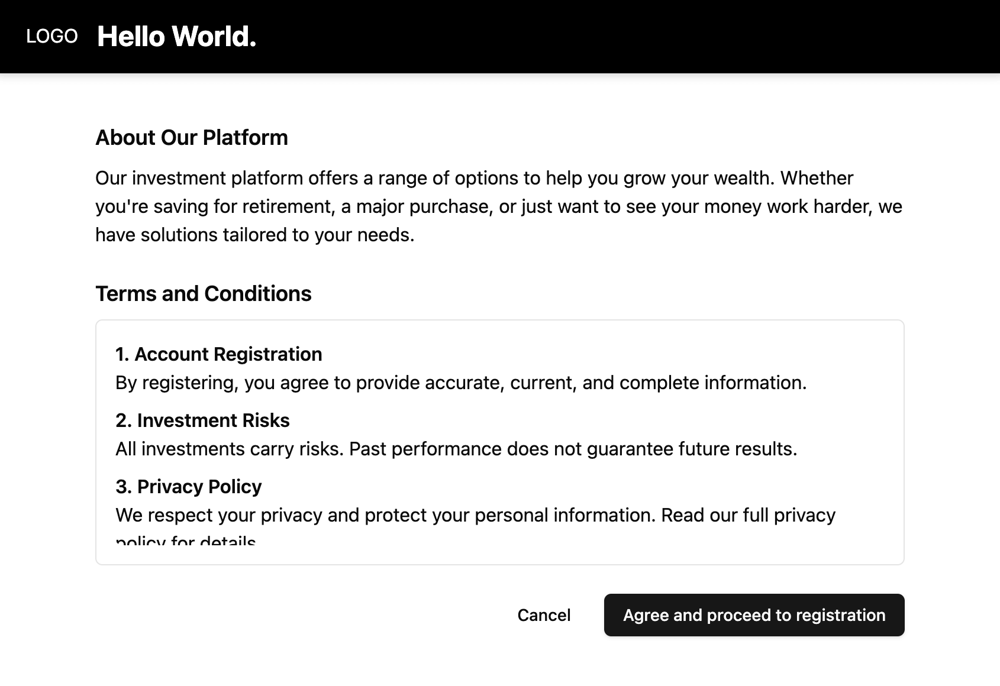

# Astro Showcase



## 🚀 Project Structure

Inside of your Astro project, you'll see the following folders and files:

```text
/
├── public/
│   └── favicon.svg
├── src/
│   ├── components/
│   │   └── common/
│   │   │   └── *.{tsx|astro}
│   │   └── ui/
│   │   │   └── *.{tsx}
│   │   └── .../
│   │       └── *.{tsx|astro}
│   ├── layouts/
│   │   └── *.astro
│   ├── lib/
│   │   └── *.ts
│   ├── middlewares/
│   │   └── *.ts
│   ├── pages/
│   │   └── *.astro
│   ├── styles/
│   │   └── globals.css
│   └── middleware.ts
├── ...
└── package.json
```

Astro looks for `.astro` or `.md` files in the `src/pages/` directory. Each page is exposed as a route based on its file name.

There's nothing special about `src/components/`, but that's where we like to put any Astro/React/Vue/Svelte/Preact components.

Common components or reusable components can be placed in the `src/components/common/`, for the ui from library like `shadcn` can be placed in `src/components/ui/` directory, and also you can name the directory as a feature like `src/components/register-step/` and place all related components inside it.

The layouts can be placed in the `src/layouts/` directory.

The utility function can be placed in the `src/lib/` directory.

The middlewares can be placed in the `src/middlewares/` directory.

The styles can be placed in the `src/styles/` directory. but we using `tailwindcss` so it could be have just only one global css file.

Any static assets, like images, can be placed in the `public/` directory.

## 🧞 Commands

All commands are run from the root of the project, from a terminal:

| Command                   | Action                                           |
| :------------------------ | :----------------------------------------------- |
| `yarn dev`             | Starts local dev server at `localhost:4321`      |
| `yarn start`             | (also) Starts local dev server at `localhost:4321`      |
| `yarn clean`           | Cleanup `dist` build directory |
| `yarn build`         | Build your production site to `./dist/`          |
| `yarn preview`       | Preview your build locally, before deploying     |
| `yarn astro` | The Astro CLI                     |

> made with ❤️ by buildingwatsize